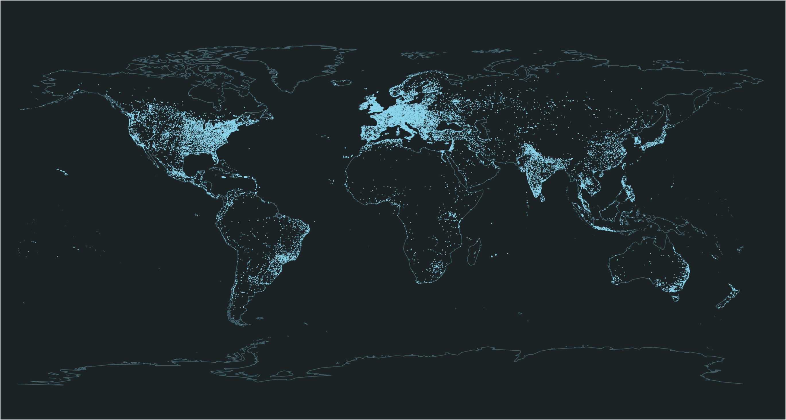

# Sand Map

Sand Map is a PowerBI custom visual developed using R & TypeScript.

## Installation?

```
1. npm install -g powerbi-visuals-tools
2. npm install
3. pbiviz package
```

## How to use it?

Import ```sand-map.pbiviz``` from ```dist/``` folder to your PowerBI project. Enjoy it!

